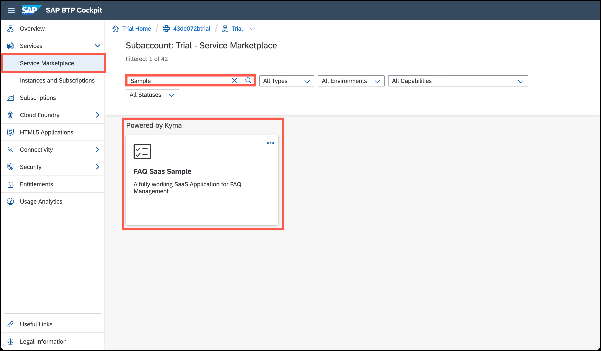
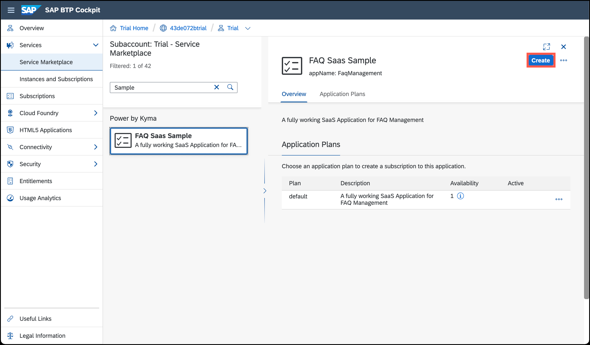
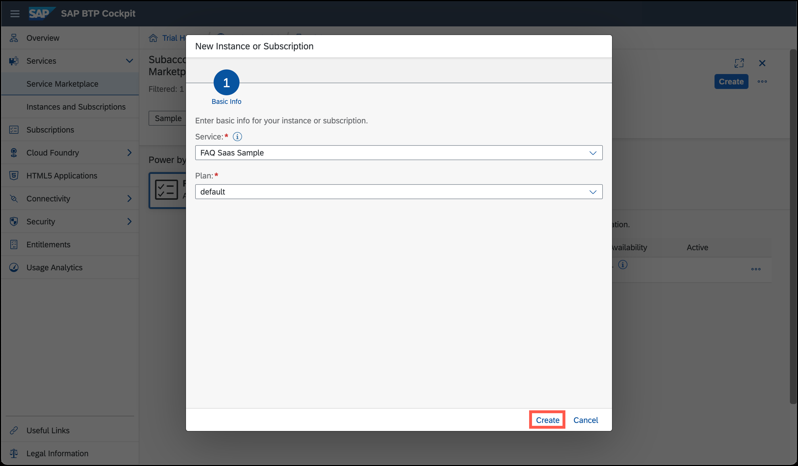
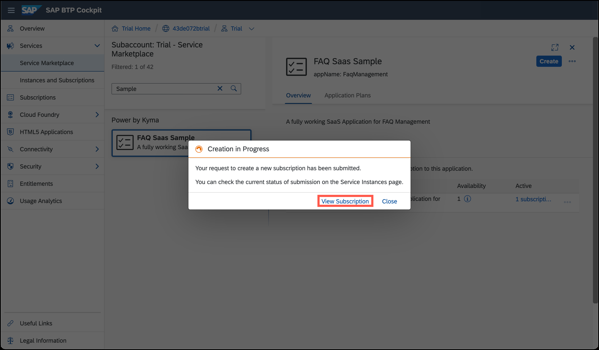
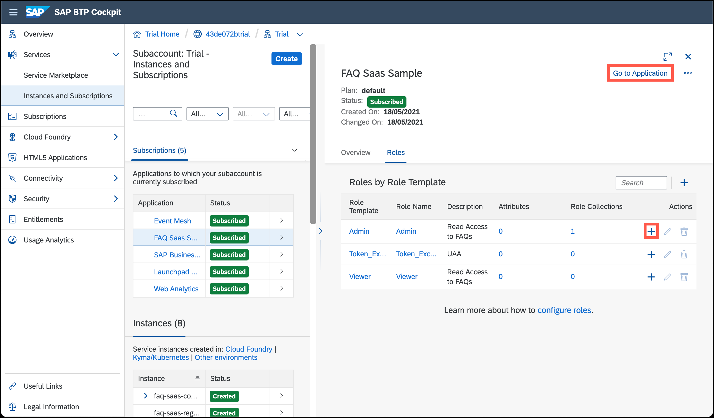
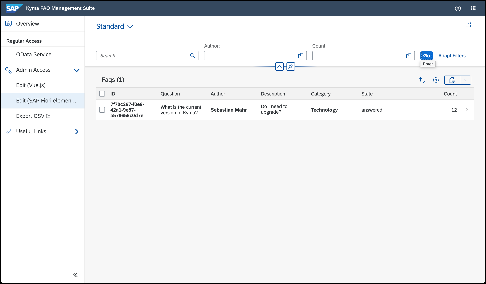
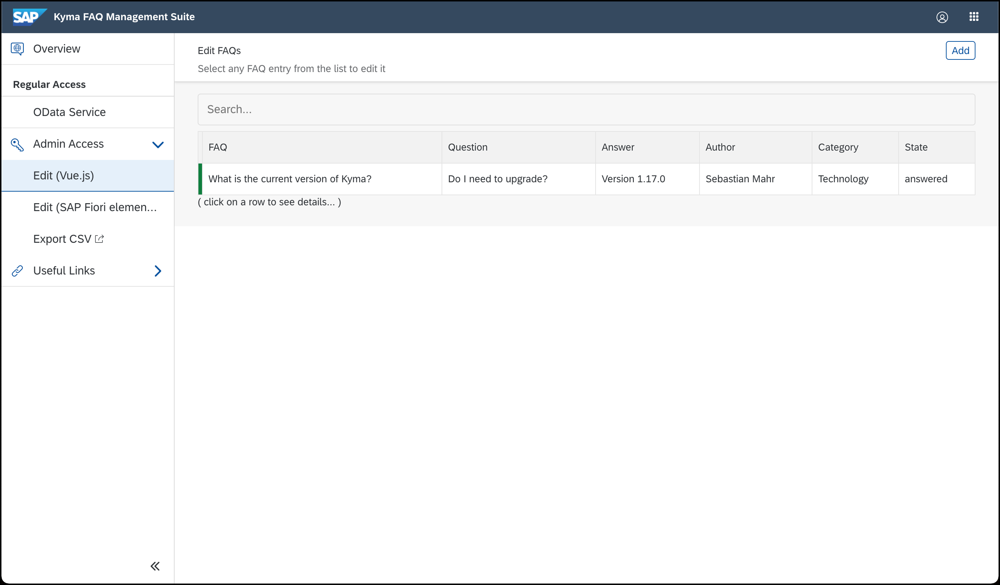
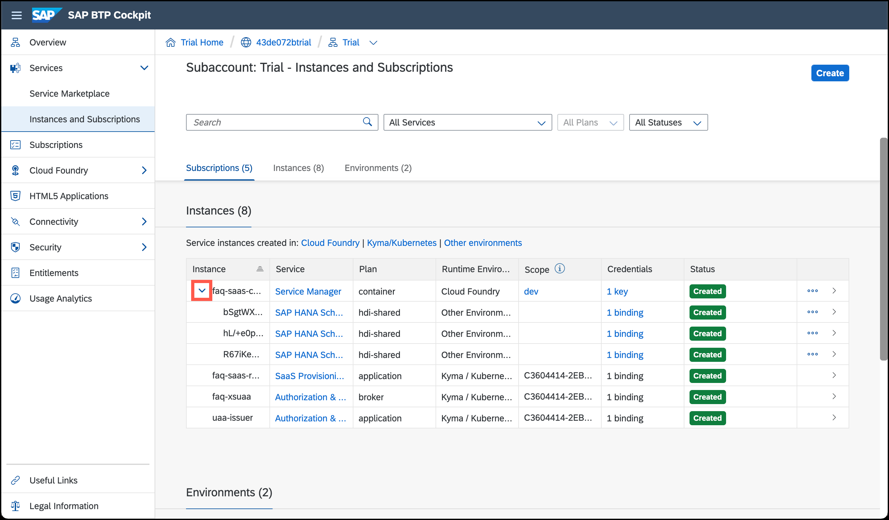

# Subscribed as a consumer

Now that you deployed all provider components (go [here](../provider-components/README.md) if you haven't done this yet), it's time to subscribe your subaccount to the SaaS solution. You can subscribe from *any* subaccount that lives in the **same region** and belongs to the **same global account** as the provider subaccount. Technically, the provider subaccount itself qualifies here as well.

## 1. Find the SaaS solution in the service marketplace
Go to the "Service Marketplace" menu in the BTP Cockpit and search for **`Sample`** to find this sample project. Then click on the tile that belongs to the category *Powered by Kyma*.

## 2. Subscribe to the SaaS solution
Hit the **Create** button in the top-right corner to open the wizard.

In the wizard, leave the default values and confirm with **Create**.

This started the subscription process. While the process is going on, click on **View Subscription** to navigate to the subscription entity.

## 3. Access the SaaS solution

Once the status turns green, use the **+ (plus)** button next to the **`Admin`**  (or the **`Viewer`**) role template to add it to an existing role collection that has your user assigned to it. If there's not role collection available, create one.

Now that the role template is assigned to your user select **Go to Application**.

Note that this application provides a web interface with a seamless user experience. The [Luigi micro frontend](https://github.com/SAP/luigi) framework helps us to achieve that even though the application consists of multiple pieces that are implemented with different technologies:

- This panel, for example, has been build with [Fundamental Vue](https://sap.github.io/fundamental-vue/#/):

- While this panel leverages an [SAP Fiori elements](https://experience.sap.com/fiori-design-web/smart-templates/) template:

> Try to assign only the **Viewer** role template to your user and log out. When you log back in, you'll notice that the app is adapted and looks different now.

## 4. See the result in the BTP Cockpit

Now it's time to go back to the subaccount level of the SAP BTP Cockpit. You'll notice that you can expand the `faq-saas-container` and see the  HDI containers created by the service manager. Two of them are used to manage metadata, and then you'll have one more per active tenant.

